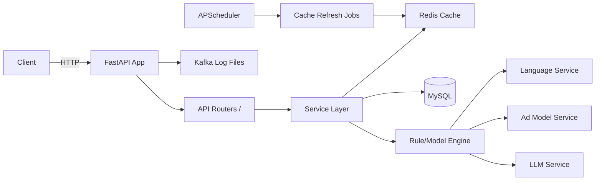
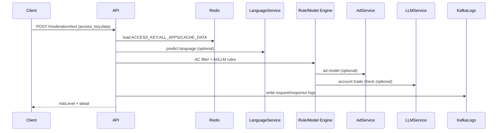

# FastAPI 重构开发文档（完整可复刻版）

本文件基于当前 Flask 项目代码整理，目标是让后端开发能直接按文档搭建“功能一致”的 FastAPI 版本，并完成运行与维护。

---

## 1. 项目概览

### 1.1 业务范围
- 文本反垃圾（聊天消息内容风控）
- 图片反垃圾
- 名单/渠道/应用配置管理
- 自研规则/模型（名单、广告模型、LLM）
- 本地缓存 + Redis 缓存联动
- 定时任务刷新缓存
- 日志与告警（文件日志 + 飞书告警）

### 1.2 核心路径与模块
- 应用入口：`chat_anti_fraud.py`
- Flask 创建：`app/__init__.py`
- 路由注册：`app/api/v1/__init__.py`
- 业务路由：`app/api/v1/*.py`
- 数据模型：`app/models/*.py`
- 校验表单：`app/validators/forms.py`
- 工具/第三方：`app/libs/*.py`
- 配置：`app/config/setting.py`, `app/config/secure.py`, `app/config/log.py`
- 部署：`start.sh`, `restart.sh`, `chat_anti_fraud.conf`, `dockerfile`

---

## 2. 运行环境与依赖

### 2.1 运行环境
- Python 3.7（README 指定）
- 生产使用 Gunicorn + Supervisor

### 2.2 现有依赖（来源 `requirements.txt`）
- 框架：Flask、Flask-Cors、Flask-APScheduler、Flask-Redis、Flask-SQLAlchemy
- 数据库/缓存：SQLAlchemy、PyMySQL、redis
- 网络：requests
- 其它：pyahocorasick、WTForms、pandas、Janome、gmssl、cryptography 等

### 2.3 FastAPI 依赖建议（保持功能一致）
建议新增以下依赖（不锁版本）：
- `fastapi`
- `uvicorn`
- `gunicorn`
- `sqlalchemy`
- `pymysql`
- `redis`
- `requests`
- `apscheduler`
- `pydantic` / `pydantic-settings`
- `python-multipart`（兼容 form 提交）

---

## 3. 配置体系与环境变量

### 3.1 配置结构（Flask 现状）
配置入口：`app/config/setting.py` 与 `app/config/secure.py`

关键环境变量：
- `deploy`：控制国家/环境
  - `inlandOline` -> `COUNTRY=zh`, `ENVIRONMENT=production`
  - `inlandTest`  -> `COUNTRY=zh`, `ENVIRONMENT=test`
  - `overseasOline` -> `COUNTRY=na`, `ENVIRONMENT=production`
  - `overseasTest`  -> `COUNTRY=na`, `ENVIRONMENT=test`
  - `sjpOnline` -> `COUNTRY=xjp`, `ENVIRONMENT=production`
  - `sjpTest`  -> `COUNTRY=xjp`, `ENVIRONMENT=test`
默认：`COUNTRY=zh`, `ENVIRONMENT=test`

### 3.2 关键配置项（需要在 FastAPI 保持一致）
- 数据库：`SQLALCHEMY_DATABASE_URI`
- Redis：`REDIS_URL`, `CHAT_LOG_REDIS_URL`
- Kafka 主题：`KAFKA_TOPIC`, `KAFKA_TOPIC_QUERY`, `KAFKA_TOPIC_JSON`, `KAFKA_TOPIC_IMG`
- 语种识别：`LANGUAGE_CLS_URL`, `LANGUAGE_SWITCH`, `MINORITY_LANG_URL`
- 广告模型：`AD_DETECT_URL`
- IP 黑名单：`BLACK_CLIENT_IP`（来自 `app/config/black_client_ip.txt`）
- 日志：`LOG`（`app/config/log.py`）
> 说明：数美/网易/腾讯/贪玩/H5 SDK 相关配置在新架构中不再需要。

### 3.3 FastAPI 配置建议
建议用 `pydantic-settings` 统一配置，分 `Base`, `Development`, `Test`, `Production`，并映射上面字段，保证字段名不变，避免业务代码大改。

---

## 4. FastAPI 目录结构建议（可直接落地）

```
app/
  main.py
  core/
    config.py
    logging.py
    scheduler.py
  api/
    v1/
      __init__.py
      text.py
      image.py
      base.py
      ...
  models/
  schemas/
  services/
  libs/
    (沿用现有 libs，稍作改造)
  db/
    session.py
    base.py
```

- `api/v1` 对应 Flask `app/api/v1`
- `libs` 可以复用现有工具代码（需把 Flask 依赖替换为 FastAPI 依赖）
- `services` 用于抽离业务逻辑，避免路由膨胀
- `schemas` 负责 Pydantic 请求/响应模型

### 4.1 架构图


### 4.2 文本风控数据流


### 4.3 缓存刷新数据流


---

## 5. 应用初始化（Flask -> FastAPI 对应关系）

| Flask 机制 | 现有位置 | FastAPI 建议 |
|---|---|---|
| 应用工厂 | `app/__init__.py:create_app()` | `main.py:create_app()` |
| 蓝图注册 | `app/api/v1/__init__.py` | `APIRouter` + `include_router` |
| before_request | `register_before_request` | `@app.middleware("http")` |
| after_request | `register_after_request` | `@app.middleware("http")` |
| errorhandler(Exception) | `handle_error_exception` | `@app.exception_handler(Exception)` |
| CORS | `apply_cors` | `CORSMiddleware` |
| APScheduler | `scheduler` | `BackgroundScheduler` + lifespan 事件 |
| JSONEncoder | `app/app.py` | `jsonable_encoder` + 自定义响应 |

---

## 6. 数据模型（数据库表结构）

所有表名由 `Base.camel2line()` 自动转换：

### 6.1 `app`
字段：
- `id` (PK, int, auto)
- `app_id` (string)
- `name` (string)
- `access_key` (string)
- `create_time`, `update_time`, `delete_time`, `create_by`, `update_by`, `delete_by`

### 6.2 `channel`
字段：
- `id` (PK)
- `no` (string)
- `name` (string)
- `memo` (string)
- 通用审计字段

### 6.3 `name_list`
字段：
- `id` (PK)
- `no` (string, unique)
- `name` (string)
- `type` / `match_rule` / `match_type` / `suggest` / `risk_type` / `status`（枚举）
- `language` (string)
- 通用审计字段

### 6.4 `list_detail`
字段：
- `id` (PK)
- `list_id` (int)
- `list_no` (string)
- `text` (string)
- `memo` (string)
- 通用审计字段

### 6.5 `list_app_channel`
字段（联合主键）：
- `list_no`
- `app_id`
- `channel_id`
- 通用审计字段

### 6.6 其它表
| 表 | 作用 | 关键字段 |
|---|---|---|
| `language` | 语种配置 | `id`, `name`, `abbrev` |
| `risk_type` | 风险类型 | `id`, `no`, `desc`, `abbrev` |
| `ai_switch` | AI 开关 | `app_id`, `switch` |
| `ac_switch` | AC 自动机开关 | `app_id`, `channel` |
| `model_threshold` | 广告模型阈值 | `app_id`, `threshold` |
> 说明：`swich_shumei`、`switch_sdk_check`、`tencent_*`、`tanwan_*` 在新架构中可不迁移。

> 注意：所有表都含通用的 `create_time/update_time/delete_time` 软删除字段。

---

## 7. Redis 结构与缓存机制

### 7.1 Redis Key 约定
- `all_apps`：所有应用 ID 集合
- `access_key`：`app_id -> access_key`
- `AC_{app_id}_{channel}`：app+channel 的名单/开关集合
  - value 中包含 `ai_switch`, `ac_switch`, `model_threshold`, 名单列表等
- `waiting_update_app_channel_list`：待更新 `AC_*` 的 zset
- `waiting_update_list_detail`：待更新名单详情的 zset
- `chat_sentinel_account_id` / `chat_sentinel_ip`：聊天哨兵策略

### 7.2 本地缓存字段
启动时及定时任务会写入：
- `ALL_APPS`
- `APP_CHANNEL`
- `CACHE_DATA`
- `ACCESS_KEY`
- `CHAT_SENTINEL`

### 7.3 定时任务
现有 `BaseConfig.JOBS`：
- `update_cache`：每 5 分钟刷新缓存

FastAPI 建议在应用启动时挂载 `APScheduler`，并在 `startup`/`shutdown` 中启动与停止。

---

## 8. API 设计（路径与请求结构）

### 8.1 路由前缀
当前 FastAPI 路由前缀：无（已移除 `/dun`）

### 8.2 文本反垃圾
- `POST /moderation/text`
- 必填参数（来自 `validators/forms.py`）：
  - `access_key`：身份校验 key
  - `ugc_source`：UGC 来源
  - `data`：字符串形式 JSON
    - 必填字段：`timestamp`, `token_id`, `nickname`, `text`, `server_id`, `account_id`,
      `app_id`, `role_id`, `vip_level`, `level`, `ip`, `channel`
    - 可选字段：`relationship`, `target_id`, `organization_id`, `team_id`, `scene_id` 等
  - `access_key` 校验逻辑：优先 Redis `ACCESS_KEY`，若不存在则匹配内置白名单映射
  - 服务端补充/改写字段：
    - `request_id` 与 `bt_id` 自动生成
    - `channel` 会被拼接为 `{app_id}_{channel}`
    - `token_id` 默认 `{app_id}_{server_id}_{role_id}`，若存在 `account_id` 则使用 `account_id`

响应结构（示例字段）：
```
{
  "status": 0,
  "code": 1100,
  "extra": {...},
  "riskLevel": "PASS|REJECT",
  "detail": {},
  "score": 0,
  "requestId": "",
  "message": "成功"
}
```

### 8.3 图片反垃圾
- `POST /moderation/images`
- `access_key` + `data`（字符串 JSON）
  - 必填字段：`timestamp`, `img`, `server_id`, `account_id`, `app_id`, `role_id`,
    `vip_level`, `level`, `ip`, `channel`, `target_id`, `organization_id`, `team_id`, `scene_id`
> 新架构不接入数美，图片风控需改为自研模型或临时返回 PASS（由业务确认）。

### 8.4 应用/渠道配置
- 应用 `app`
  - `GET /apps/<app_id>`
  - `GET /apps`
  - `POST /apps`
  - `PUT /apps/<app_id>`
  - `DELETE /apps/<app_id>`
- 渠道 `channel`
  - `GET /channels/<cno>`
  - `GET /channels`
  - `POST /channels`
  - `PUT /channels/<cno>`
  - `DELETE /channels/<cno>`

### 8.5 名单/详情
- `GET /name-lists/<lid>`
- `GET /name-lists`
- `POST /name-lists`
- `PUT /name-lists/<lid>`
- `DELETE /name-lists/<lid>`
- `PATCH /name-lists/<lid>/status`

- `GET /list-details/<did>`
- `GET /list-details/search?text=<text>`
- `GET /list-details`
- `POST /list-details`
- `POST /list-details/batch`
- `PUT /list-details/<did>`
- `DELETE /list-details/by-text`
- `DELETE /list-details/<did>`
- `DELETE /list-details/batch`

### 8.6 风险类型/语种
- `GET /risk-types`
- `POST /risk-types`
- `GET /languages/<lid>`
- `GET /languages`
- `POST /languages`
- `PUT /languages/<language_id>`
- `DELETE /languages/<language_id>`

### 8.7 开关与阈值
- `GET/POST/PUT/DELETE /ai-switches`
- `GET/POST/PUT/DELETE /ac-switches`
- `GET/POST/PUT/DELETE /model-thresholds`

### 8.8 黑名单 IP
- `GET /blacklisted-ips`
- `POST /blacklisted-ips`
- `DELETE /blacklisted-ips/{ip}`

### 8.9 缓存/管理接口（base）
位于 `app/api/v1/base.py`，主要用于调试/缓存刷新：
- `GET /cache/apps`
- `GET /cache/app-channels`
- `GET /cache/list-data`
- `POST /cache/refresh`
- `POST /cache/redis/import`
- `POST /cache/apps/refresh-from-redis`
- `GET /cache/redis/apps`
- `POST /cache/app-channels/refresh-from-redis`
- `GET /cache/redis/pending-list-details`
- `GET /cache/redis/pending-app-channels`
- `GET /cache/redis/app-channels`
- `POST /cache/list-data/refresh-from-redis`
- `GET /cache/redis/list-data`
- `POST /cache/apps/refresh-from-db`
- `POST /cache/redis/pending-app-channels/reset`
- `POST /cache/redis/pending-list-details/reset`
- `GET /cache/redis/chat-sentinel/accounts`
- `GET /cache/redis/chat-sentinel/ips`
- `POST /cache/redis/chat-sentinel/ips/reset?rule=xxx`
- `POST /cache/redis/chat-sentinel/accounts/reset?rule=xxx`

### 8.10 错误响应格式
`APIException` 返回 JSON：
```
{
  "message": "错误信息",
  "code": 1902,
  "requestId": "uuid"
}
```
HTTP 状态码与 `code` 不是同一概念：例如 `ParameterException` 的 HTTP code 是 200，但 `code=1902`。

---

## 9. 文本反垃圾核心流程（必须保持一致）

1. 解析 `data` JSON（字符串形式）
2. 补齐字段（如 `token_id`、`request_id`、`bt_id`，并修正 `channel` 前缀）
3. 某些应用（`2013101`, `2013001`）会拉取历史聊天（`CHAT_LOG_REDIS_CLIENT`）
4. 校验 `app_id` 是否存在于缓存 `ALL_APPS`
5. 语种识别（可开关 `LANGUAGE_SWITCH`）
6. 本地名单过滤（AC 自动机）
   - 白名单优先 PASS
   - 忽略名单清洗文本
   - 黑名单命中 -> REJECT
7. 广告模型检测（按 `ai_switch` / `model_threshold`）
8. LLM 账号买卖判别（仅 `2013101`, `2013001`）
9. 返回统一响应结构

---

## 10. 外部依赖（仅保留内部服务）

### 10.1 语种识别
- `LANGUAGE_CLS_URL` 接口，超时 0.2s

### 10.2 广告模型
- `AD_DETECT_URL`，超时 0.8s
- `model_threshold` 从 Redis 缓存读取

### 10.3 LLM 判别（账号买卖）
- `llm_utils.get_llm_ans()`
- 仅对特定 app_id 生效：`2013101`, `2013001`

---

## 11. 日志与告警

### 11.1 日志
- 普通日志：`LOG` 配置（`logs/output`）
- Kafka 日志写文件：`logs/kafka`
- gunicorn 日志：`logs/gunicorn`
- `text`/`image` 请求在 `after_request` 会写入 Kafka 日志文件
- 真实客户端 IP 优先取请求头 `Yz-Client-Ip`

### 11.2 告警
- 全局异常捕获后，若 URL 包含 `v1` 或 `dun`，调用 `send_feishu_message`

---

## 12. 启动与部署

### 12.1 生产启动
- `start.sh` -> `supervisord -c chat_anti_fraud.conf`
- Gunicorn 启动命令：
  `gunicorn --timeout 180 -w8 --threads 4 -b0.0.0.0:22560 chat_anti_fraud:app`

### 12.2 Docker
- 基于 `dockerfile`，容器内执行 `./start.sh`

---

## 13. FastAPI 实现关键点（必须对齐）

1. **保持接口路径与返回格式一致**
2. **data 字段仍支持字符串 JSON**（避免旧客户端兼容问题）
3. **Redis 缓存结构不变**
4. **定时任务调度不变**
5. **异常返回结构一致（含 `requestId`）**
6. **日志输出路径与行为一致**

---

## 14. 迁移实施建议（步骤）

1. 先搭建 FastAPI 基础骨架（按第 4 节）
2. 复用 `libs` 与 `models`，替换 Flask 依赖
3. 将 `validators/forms.py` 映射为 Pydantic
4. 逐个路由迁移，确保响应结构一致
5. 增加中间件：请求耗时、请求日志、Kafka 日志
6. 加入 APScheduler 定时任务
7. 对照数据库结构与 Redis key 验证一致性

---

## 15. 测试清单（必须通过）

- 文本接口：PASS/REJECT 分支
- 图片接口：自研/占位逻辑是否符合预期
- 名单 CRUD：数据库 + Redis 同步
- Redis 更新缓存任务
- 开关类接口（AI/AC/阈值）
- 日志与飞书告警

---

## 16. 风险点提示

- `data` 字段 JSON 解析异常需要兼容（当前代码做了多次字符串清洗）
- Redis 结构依赖强，请勿改变 key 规则
- 图片接口不接第三方后，需明确自研/占位策略以避免误判
